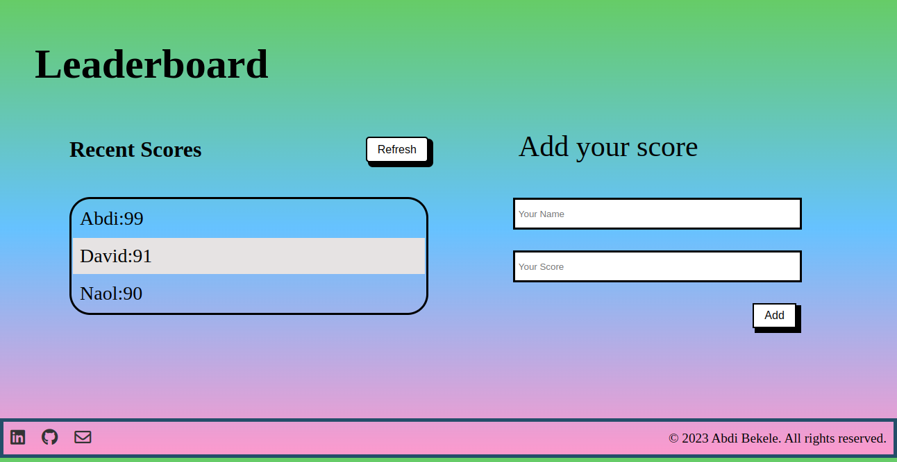
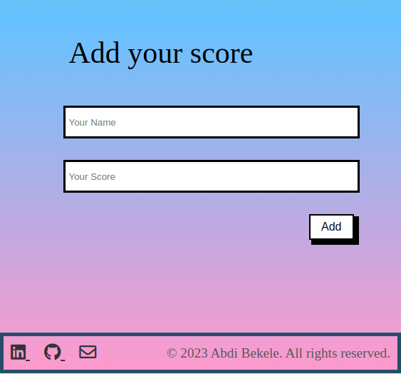

<a name="readme-top"></a>


<div align="center">
  
  <br/>

  <h3><b>Leaderboard</b></h3>

</div>

<!-- TABLE OF CONTENTS -->

# 📗 Table of Contents

- [📖 About the Project](#about-project)
  - [🛠 Built With](#built-with)
    - [Tech Stack](#tech-stack)
    - [Key Features](#key-features)
  - [🚀 Live Demo](#live-demo)
- [💻 Getting Started](#getting-started)
  - [Setup](#setup)
  - [Prerequisites](#prerequisites)
  - [Install](#install)
  - [Usage](#usage)
  - [Run tests](#run-tests)
  - [Deployment](#triangular_flag_on_post-deployment)
- [👥 Authors](#authors)
- [🔭 Future Features](#future-features)
- [🤝 Contributing](#contributing)
- [⭐️ Show your support](#support)
- [🙏 Acknowledgements](#acknowledgements)
- [📝 License](#license)

<!-- PROJECT DESCRIPTION -->

# 📖 [Leaderboard] <a name="about-project"></a>
Leaderboard games are competitive games where players aim for the top spot on a public leaderboard by completing tasks and earning points. The leaderboard displays scores for comparison, creating a sense of community and competition. These games are found in various genres and are often played online with global rankings.


### Tech Stack <a name="tech-stack"></a>


<details>
  <summary>Client</summary>
  <ul>
    <li>HTML</li>
    <li>CSS</li>
    <li>JAVASCRIPT</li>
  </ul>
</details>


<!-- Features -->

### Key Features <a name="key-features"></a>

- **[Design]**


- **[Responsive design]**
<p align="center">
  
  
</p>


<p align="right">(<a href="#readme-top">back to top</a>)</p>

<!-- LIVE DEMO -->

## 🚀 Live Demo <a name="live-demo"></a>


- [Leaderboard](https://lul-abdifan.github.io/Leaderboard/)

<p align="right">(<a href="#readme-top">back to top</a>)</p>

<!-- GETTING STARTED -->

## 💻 Getting Started <a name="getting-started"></a>


To get a local copy up and running, follow these steps.

### Prerequisites

In order to run this project you need:
<ul>
    <li>The current version of node</li>
    <li>To have Git installed on your local machine</li>
    <li>Node Package manager (npm) </li>
    <li>An editor such as Visual Studio Code</li>
  </ul>


### Setup

Clone this repository to your desired folder:
<ul>
    <li>Create your classic access token from github.com and Run the following code with your github account</li>
   
```sh
    git clone git@github.com:Lul-Abdifan/Leaderboard.git 
    git config --global user.email "your_email@gmail.com 
    git config --global user.name "your_name"

```
 
 
  </ul>
  
  


### Install

Install this project with:

- In the first commit of your feature branch create a .github/workflows folder and add a copy of [.github/workflows/linters.yml](https://github.com/microverseinc/linters-config/blob/master/html-css-js/.github/workflows/linters.yml) to that folder.
- create a .gitignore file and add 'node_modules' to it


  
 ```sh
        npm init -y
        npm install --save-dev hint@7.x

```
- Copy [hintrc](https://github.com/microverseinc/linters-config/blob/master/html-css-js/.hintrc) to the root directory of your project.
 ```sh
        npx hint .

```
- Fix validation errors.
     
     
   ```sh
       npm install --save-dev stylelint@13.x stylelint-scss@3.x stylelint-config-standard@21.x stylelint-csstree-validator@1.x
  ```    
        
        
- Copy [stylelintrc.json](https://github.com/microverseinc/linters-config/blob/master/html-css-js/.stylelintrc.json) to the root directory of your project.


 ```sh
       npx stylelint "**/*.{css,scss}"

```

- Fix linter errors
 ```sh
       npm install --save-dev eslint@7.x eslint-config-airbnb-base@14.x eslint-plugin-import@2.x babel-eslint@10.x

```

- Copy [eslintrc.json](https://github.com/microverseinc/linters-config/tree/master/html-css-js)
 ```sh
       npx eslint .  or npx eslint . --fix

```
- Fix linter error.


### Usage

To run the project, execute the following command:

```sh
  use git bash to open in Vs code 
```


### Run tests

To run tests, run the following command:


```sh
Run "npx hint ." 
Run "npx stylelint "**/*.{css,scss} --fix " to fix linters 
Run "npx eslint . --fix to fix linters"
```

  ### Deployment

On Github Page

[Documentation](https://docs.github.com/en/pages/configuring-a-custom-domain-for-your-github-pages-site) <br>
Follow this Video to learn the easiest way to deploy using commands [Github](https://www.youtube.com/watch?v=4G6O0BIoq6M)


On Netlify  [Netlify](https://www.netlify.com/)

On Render  [Render](https://www.render.com/)

<p align="right">(<a href="#readme-top">back to top</a>)</p>

<!-- AUTHORS -->

## 👤  Author <a name="authors"></a>


- GitHub: [Abdi Bekele](https://github.com/Lul-Abdifan)
- LinkedIn: [LinkedIn](https://www.linkedin.com/in/abdi-bekele-a63860254/)
- e-mail: [tasanbannu@gmail.com](mailto:tasanbannu@gmail.com)


<p align="right">(<a href="#readme-top">back to top</a>)</p>

<!-- FUTURE FEATURES -->


<p align="right">(<a href="#readme-top">back to top</a>)</p>

<!-- CONTRIBUTING -->

## 🤝 Contributing <a name="contributing"></a>

Contributions, issues, and feature requests are welcome!

Feel free to check the [issues page](../../issues/).

<p align="right">(<a href="#readme-top">back to top</a>)</p>

<!-- SUPPORT -->

## ⭐️ Show your support <a name="support"></a>

If you like this project, kindly drop a star for me.

<p align="right">(<a href="#readme-top">back to top</a>)</p>

<!-- ACKNOWLEDGEMENTS -->

## 🙏 Acknowledgments <a name="acknowledgements"></a>

I would like to use this medium to appreciate Microverse that bringing me The best platform ever for me.

<p align="right">(<a href="#readme-top">back to top</a>)</p>


<!-- LICENSE -->

## 📝 License <a name="license"></a>

This project is [MIT](./MIT.md) licensed.


<p align="right">(<a href="#readme-top">back to top</a>)</p>
